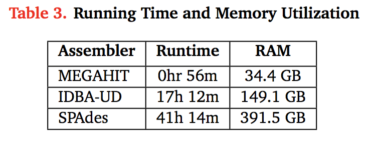
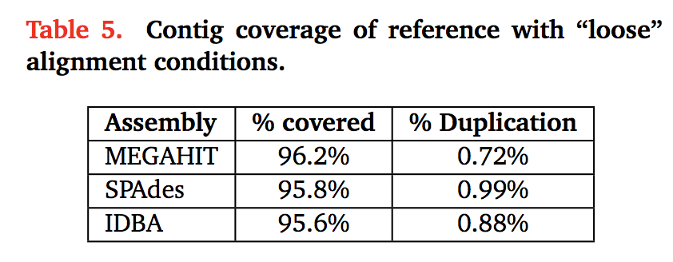
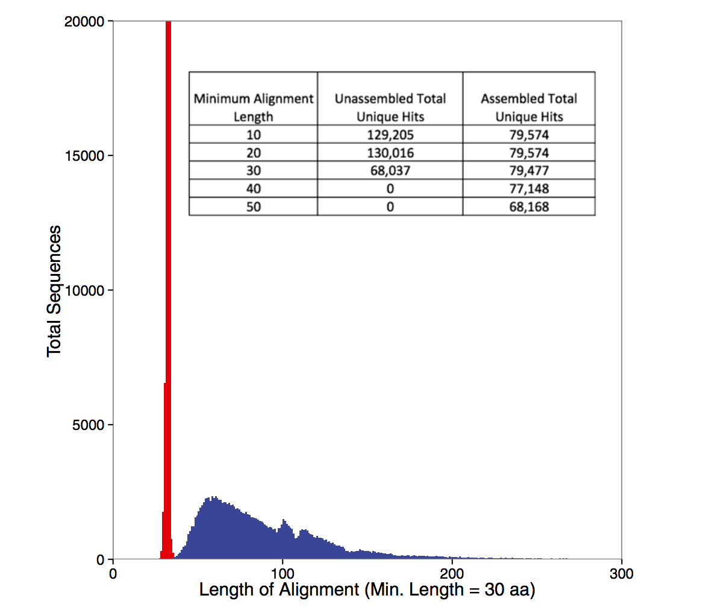

# Run the MEGAHIT assembler

[MEGAHIT](https://github.com/voutcn/megahit) is a very fast, quite
good assembler designed for metagenomes.

First, install some necessary software:

```
sudo apt-get update && \
sudo apt-get install -y make libc6-dev g++ zlib1g-dev
```

Then, build the latest version of MEGAHIT:

```
cd ~/
git clone https://github.com/voutcn/megahit.git
cd megahit
make
```

Now, download some data:

```
mkdir -p ~/data
cd ~/data
wget http://public.ged.msu.edu.s3.amazonaws.com/ecoli_ref-5m-trim.se.fq.gz
wget http://public.ged.msu.edu.s3.amazonaws.com/ecoli_ref-5m-trim.pe.fq.gz
```

Now, finally, run the assembler!

```
mkdir ~/assembly
cd ~/assembly
ln -fs ../data/*.fq.gz .

~/megahit/megahit --12 ecoli_ref-5m-trim.pe.fq.gz -r ecoli_ref-5m-trim.se.fq.gz -o ecoli -f
```

This will take about 2 minutes; at the end you should see output like
this:

```
--- [STAT] 133 contigs, total 4567337 bp, min 212 bp, max 235645 bp, avg 34341 bp, N50 106391 bp
--- [Tue May  9 12:53:45 2017] ALL DONE. Time elapsed: 127.323246 seconds ---
```

The output assembly will be in `ecoli/final.contigs.fa`.

While the assembly runs...
--------------------------

Interpreting the MEGAHIT working output :)

What does, and doesn't, assemble?

How good is assembly anyway?

Discussion:

Why would we assemble, vs looking at raw reads?  What are the
advantages and disadvantages?

What are the technology tradeoffs between Illumina HiSeq, Illumina
MiSeq, and PacBio? (Also see `this paper
<http://ivory.idyll.org/blog/2015-sharon-paper.html>`__.)

What kind of experimental design considerations should you have if you
plan to assemble?

Some figures: the first two come from work by Dr. Sherine Awad on
analyzing the data from Shakya et al (2014).  The third comes from
an analysis of read search vs contig search of a protein database.







   
## After the assembly is finished

At this point we can do a bunch of things; see 

* annotate the assembly;
* evaluate the assembly's inclusion of k-mers and reads;
* set up a BLAST database so that we can search it for genes of interest;
* quantify the abundance of the contigs or genes in the assembly, using the original read data set;
* if doing metagenomics, bin the contigs in the assembly into species bins;

see [our other tutorials](https://2017-ucsc-metagenomics.readthedocs.io/en/latest/assemble.html#after-the-assembly-is-finished) for details!

-----------------------------------------------

[Return to index](index.html)
