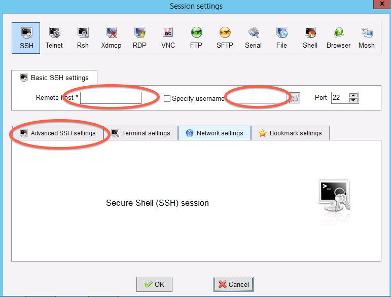

===============================================================
Logging into your new instance "in the cloud" (Windows version)
===============================================================

We've created one Amazon instance per person -- please `pick one corresponding to your number <https://github.com/ngs-docs/2017-lapaz-assembly/blob/master/_static/instances.csv>`__.

Copy the name or number of your computer , and connect to that
computer with ssh under the username 'ubuntu', as follows.

---

Install mobaxterm
~~~~~~~~~~~~~~~~~

First, download `mobaxterm home edition (portable)  <http://mobaxterm.mobatek.net/download-home-edition.html>`__ and
run it.

Start a new session
~~~~~~~~~~~~~~~~~~~

.. image:: images/ec2-moba-1.png
   :width: 80%

Fill in session settings
~~~~~~~~~~~~~~~~~~~~~~~~

Put in your hostname (should be
``ec2-XXX-YYY-ZZZ-AAA.compute-1.amazon.aws.com``), select
'specify username', and enter 'ubuntu'.

Specify the session key
~~~~~~~~~~~~~~~~~~~~~~~

Copy the downloaded .pem file onto your primary hard disk (generally
C:) and the put in the full path to it.

Click OK
~~~~~~~~

Victory! (?)

----

`Return to index <../index.html>`__
